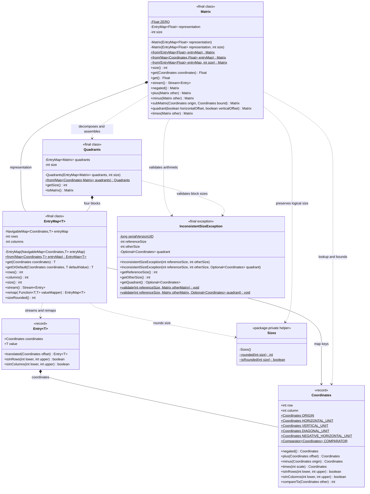

# PA4: Matrix Quadrants and Strassen Multiplication

This Java 17 project implements the quadrant representation and recursive
Strassen matrix multiplication required by CSDS 293 Programming Assignment 4.
It builds on the immutable sparse-matrix foundations from PA3.

## Functionality

- `Coordinates` and `Entry` identify entries in half-open row and column ranges.
- `EntryMap` provides ordered streaming, functional remapping, and power-of-two sizing.
- `Matrix` provides sparse access, negation, addition, subtraction, translated block extraction,
  quadrant extraction, and recursive Strassen multiplication.
- `Quadrants` validates four equal-size matrix blocks and assembles them into one matrix.
- `InconsistentSizeException` records both incompatible sizes and, when applicable,
  the coordinate identifying the offending quadrant.
- Matrix operations and quadrant assembly preserve logical dimensions even when
  trailing values are zero.


## Project structure

```text
PA4/
├── pom.xml
└── src/
    ├── main/java/strassen/     production classes
    └── test/java/strassen/     matching JUnit tests
```


Maven is used for repeatable Java 17 compilation, JUnit dependency management,
test execution, and packaging. This avoids machine-specific JAR files and manual
classpath configuration, and lets VS Code import the same build used from the
terminal.

## Architecture



## Craftsmanship

- **Small, focused types:** `Coordinates` handles location and ordering,
  `Entry<T>` binds a location to a value, `EntryMap<T>` owns sparse storage,
  and `Quadrants` owns four-block validation and assembly. Each class has one
  clear reason to change.
- **Immutable value objects:** `Coordinates` and `Entry<T>` are records, so their
  data, equality, hash code, and string representation have consistent value
  semantics. Operations return new objects instead of changing existing ones,
  which makes later matrix algorithms easier to reason about.
- **Protected ownership:** `EntryMap.from` validates and defensively copies the
  caller's map into an unmodifiable `NavigableMap`. Later changes to the source
  map therefore cannot silently change the matrix.
- **One ordering rule:** natural ordering and `Coordinates.COMPARATOR` both use
  row first and column second. The `TreeMap` uses that same comparator, avoiding
  conflicting definitions of coordinate order.
- **Efficient repeated queries:** `EntryMap` calculates row and column dimensions
  once during construction. `rows()`, `columns()`, and `size()` are then constant
  time instead of rescanning every entry.
- **Clear failure behavior:** public methods reject invalid or null arguments
  with exceptions close to the source of the error. The private constructor uses
  an assertion for its internal invariant, following the assignment's boundary
  between public and non-public error handling.
- **Reusable representation:** generic `EntryMap<T>` stores both scalar entries
  and matrix blocks. Public operations do not expose mutable backing maps, so
  callers cannot change a matrix or quadrant set after construction.
- **Recursive composition:** Strassen multiplication delegates decomposition and
  reassembly to the quadrant abstractions, keeping coordinate translation out of
  the multiplication formulas.


## Test design


### `CoordinatesTest`

- `exposesRequiredConstants` catches incorrect names or row/column directions.
- `performsCoordinateArithmeticWithoutChangingTheOriginal` verifies every
  arithmetic operation and proves the record remains immutable.
- `comparesByRowThenColumn` protects the ordering required by the sparse map.
- `rejectsNullCoordinateOperands` verifies the public precondition policy.

### `EntryTest`

- `translatesCoordinatesAndPreservesValue` checks that translation moves only
  the coordinates and retains the generic value.
- `rejectsNullConstructorArgumentsAndOffset` prevents incomplete entries and
  confirms null offsets fail immediately.

### `EntryMapTest`

- `retrievesValuesAndComputesSparseDimensions` covers present and missing lookups,
  default values, rectangular sparse dimensions, and overall size together.
- `reportsZeroDimensionsWhenEmpty` protects the important empty-matrix boundary.
- `copiesTheSourceMap` proves defensive copying by changing the original map
  after construction and checking that the `EntryMap` does not change.
- `rejectsInvalidPublicArguments` covers null maps, keys, values, lookup arguments,
  defaults, and negative matrix coordinates so invalid state cannot enter the
  representation.
- Streaming, remapping, and rounded-size tests cover the PA3 additions.

### `MatrixTest`, `QuadrantsTest`, and `InconsistentSizeExceptionTest`

- Factory and accessor tests verify sparse zero behavior and power-of-two sizing.
- Arithmetic tests cover negation, addition, subtraction, cancellation, nulls,
  and inconsistent sizes.
- Submatrix tests verify half-open filtering, coordinate translation, retained
  logical dimensions, and invalid bounds.
- Quadrant tests verify all four offset combinations against the assignment's
  4-by-4 example and check that assembly reconstructs dense and sparse matrices.
- Quadrant validation tests cover missing, null, and differently sized blocks,
  including the offending-quadrant metadata attached to size failures.
- Multiplication tests cover the 1-by-1 base case and recursive 2-by-2 and 4-by-4
  products, along with null operands, size mismatches, and sparse zero results.


## Build commands

```text
mvn clean test
mvn package
```

The packaged classes are written under `target/`; no executable application is
expected for this library-style assignment.
